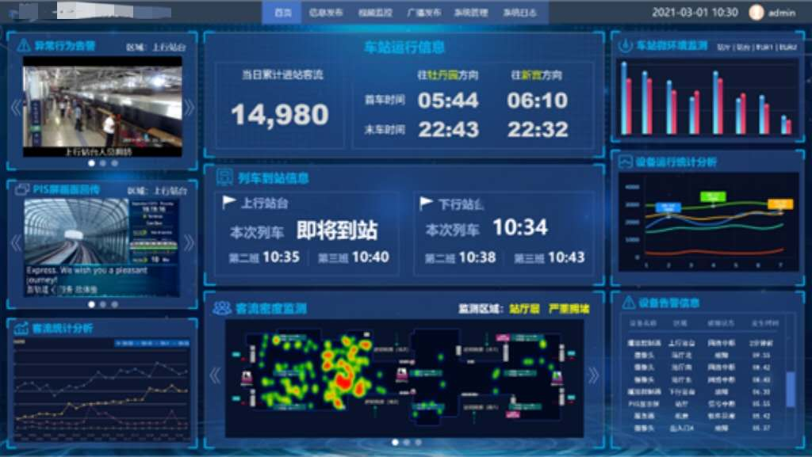
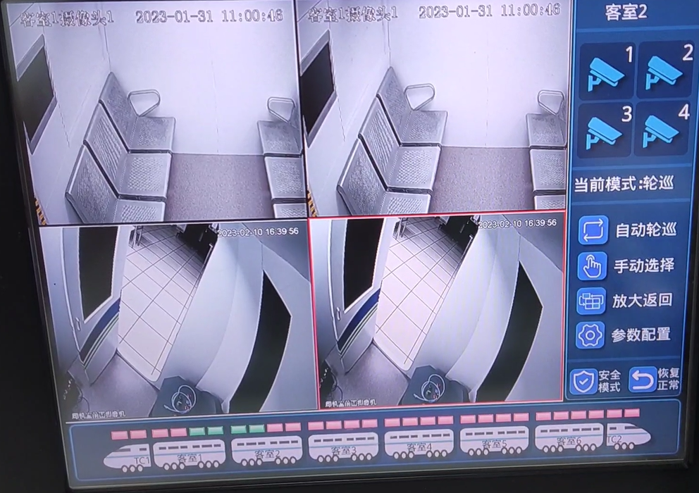
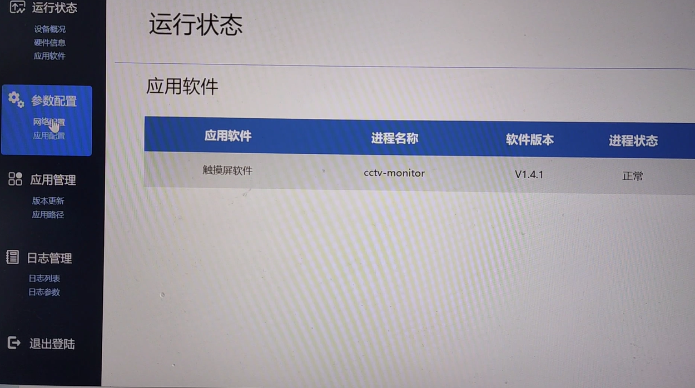
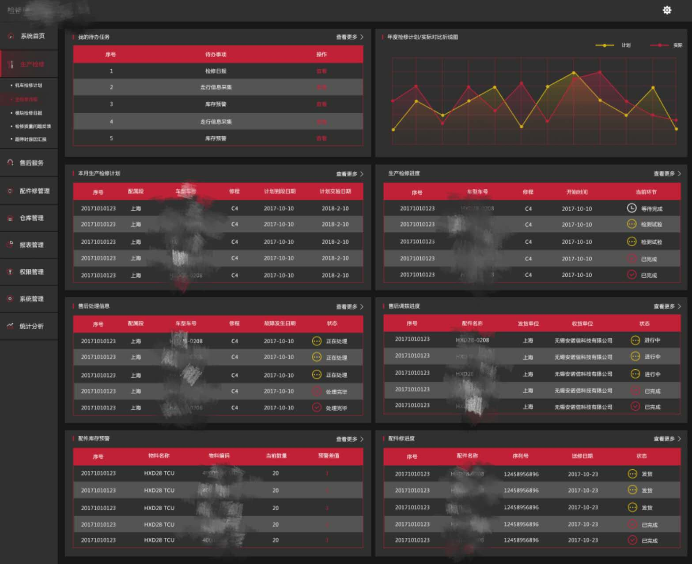

## 1. **Smart Passenger Service Integrated Control Platform for Urban Rail Transit**

**Description**: This is a brief description of the first project. It includes all the amazing details about what was achieved and how it works. Click below to see more.

[View Project](#) | [GitHub Repo](#)

---

## 2. **Software Assistant**

**Description**: This is a brief description of the second project. It involves cutting-edge technology and a modern design. Click below to see more.

[View Project](#) | [GitHub Repo](#)

---

## 3. **Vehicle-Mounted Embedded System **

**Description**: A great project that showcases my skills in web development, including advanced techniques. Learn more about it by clicking below.

[View Project](#) | [GitHub Repo](#)

---

## 4. **Maintenance System**

**Description**: An amazing mobile app that I developed with the latest technologies. Take a look at the project here.

[View Project](#) | [GitHub Repo](#)

---

### Contact Me

If you would like to get in touch, feel free to check out my [contact page](#) or reach out through my social media!

